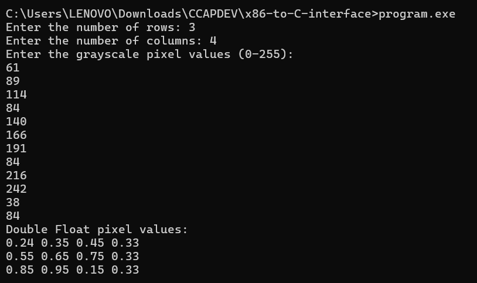

# x86-to-C-interface
Group:
- Dela Cruz, Rein
- Naling, Sebstien
## How to run

First, open cmd in respective root folder:

```bash
nasm -f win64 -o asmfile.obj asmfile.asm
gcc -m64 cfile.c asmfile.obj -o program.exe
program.exe
```

## Test runs
| Test no:   | Time in Seconds |
|:----------:|:----------------:|
| 1          | 0.00000          |
| 2          | 0.00000          |
| 3          | 0.00000          |
| 4          | 0.00000          |
| 5          | 0.00000          |
| 6          | 0.00000          |
| 7          | 0.00000          |
| 8          | 0.00000          |
| 9          | 0.00000          |
| 10         | 0.00000          |
| 11         | 0.00000          |
| 12         | 0.00000          |
| 13         | 0.00000          |
| 14         | 0.00000          |
| 15         | 0.00000          |
| 16         | 0.00000        |
| 17         | 0.00000        |
| 18         | 0.00000        |
| 19         | 0.00000        |
| 20         | 0.00000         |
| 21         | 0.006000        |
| 22         | 0.006000       |
| 23         | 0.005000        |
| 24         | 0.005000        |
| 25         | 0.005000        |
| 26         | 0.005000       |
| 27         | 0.005000        |
| 28         | 0.005000        |
| 29         | 0.005000        |
| 30         | 0.006000       |
| *Avg Time* | *0.0018*      |

## Analysis
  The use of the assembly function has significantly improved the execution time of the program. Because even with input sizes as large as 100*100, the execution time of the function is 0 or so minimal that it becomes insignificant.

## Program Correctness

